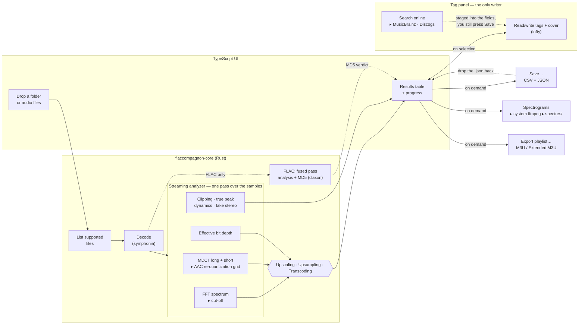

# FlacCompagnon

[](https://github.com/craft-and-code/FlacCompagnon/actions/workflows/ci.yml)
[](https://github.com/craft-and-code/FlacCompagnon/actions/workflows/release.yml)
[](https://github.com/craft-and-code/FlacCompagnon/actions/workflows/site.yml)

[](https://craft-and-code.github.io/FlacCompagnon/)
[](https://craft-and-code.github.io/FlacCompagnon/doc/)
[](https://github.com/craft-and-code/FlacCompagnon/releases/latest)
[](LICENSE)

**A cross-platform desktop tool that checks whether your "lossless" audio is actually lossless.**

> **About this project.** FlacCompagnon was built with an AI assistant, as an experiment: how far can AI-assisted development go on a real, non-trivial piece of software — signal processing, a native desktop app, tests, CI, documentation? It also serves as a working case study on how to use AI effectively: every detection algorithm was validated against independently computed ground truth (reference encoders, real files, bit-exact replicas) before being trusted, and the limitations that remain are documented rather than hidden. The AAC transcoding detection notably implements the re-quantization method described in the peer-reviewed study _"Lossless Audio Checker: A Software for the Detection of Upscaling, Upsampling, and Transcoding in Lossless Musical Tracks"_ by Julien Lacroix, Yann Prime, Alexandre Remy and Olivier Derrien (AES 139th Convention, Paper 9416, 2015).

FlacCompagnon is a from-scratch, open-source successor to the discontinued _Lossless Audio Checker_. Drop a folder **or a single audio file** onto the window and it runs the same three independent detections as the original — **Upscaling**, **Upsampling**, and **Transcoding** (including the **AAC re-quantization** test, which catches AAC sources at every bitrate) — verifies **FLAC MD5** signatures, flags **fake stereo** files, detects **clipping**, and can render a **spectrogram** for each track.

Beyond checking, it also **edits tags and cover art** (single files or whole selections at once, with an optional **MusicBrainz/Discogs** lookup) and **exports M3U playlists** in whatever order you arrange the table.

Built with **Rust** and **Tauri v2**, it compiles to a small native app for **Linux, Windows, and macOS**.

---

## What it does

### 1. Authenticity detections (Lossless Audio Checker model)

FlacCompagnon runs the same three **independent** detections as the original Lossless Audio Checker. A file can trip none, one, or several; if none fire it is reported **Clean**. The **Detections** column shows a coloured tag per finding, and hovering it explains the reasoning.

| Detection       | Meaning                                                                                                                                                                                                                                                                                                                                                                                                         |
| --------------- | --------------------------------------------------------------------------------------------------------------------------------------------------------------------------------------------------------------------------------------------------------------------------------------------------------------------------------------------------------------------------------------------------------------- |
| **Upscaling**   | Fake resolution: a ≤16-bit signal stored at 24-bit (the low bits carry no real information).                                                                                                                                                                                                                                                                                                                    |
| **Upsampling**  | Fake sample rate: a high-rate container (e.g. 96 kHz) whose content stops sharply around the CD range (~22 kHz).                                                                                                                                                                                                                                                                                                |
| **Transcoding** | Lossy source re-wrapped as lossless. Three signatures, strongest first: the **AAC re-quantization grid** (coefficients snap onto AAC's quantization grid at a synchronized MDCT alignment — near-conclusive, catches every bitrate), an MDCT-domain high-frequency dead zone, and a brick-wall spectral cut-off. Shown as _Transcoded_ (detected) or _Transcoded?_ (a gentle early roll-off that is ambiguous). |

See [Detection algorithms](#detection-algorithms) below for how each works, and its limitations. Like the original, these are informed heuristics, not cryptographic proof — the spectrogram is the final arbiter.

A **search field** above the table filters which rows are shown — type a format, a bit depth, a detection name, anything a column displays. It only ever affects the display: playback order, the current selection, drag-reordering, and every export (CSV, JSON, M3U) all keep working off the full list, filtered or not.

**Right-click the header** to show or hide columns. To reorder the ones you've kept, press and hold a header cell and drag it left or right — the same gesture as dragging a row to reorder the list, just held a moment first so it doesn't collide with an ordinary click-to-sort. This includes **Quality** and **MD5**: both only ever appear when the data actually warrants them (a badge exists; a FLAC file is present), but where they show up in that order, like every other column, is yours to move. Columns added after your first run (see below) start hidden; anything you already had showing stays showing. The choice is remembered between launches. Alongside the always-computed columns, three more are available but hidden by default: **Codec** (the codec inside a multi-codec container — an M4A can hold ALAC or AAC, an OGG can hold Vorbis or Opus — blank when the container is already single-codec, like FLAC), **Bitrate** (the file's overall average, size × 8 ÷ duration — the same figure a tool like MediaInfo calls the "overall bit rate"), and **Modified** (the file's filesystem modification date). Seven tag fields can also be added as columns — **Artist, Album, Title, Track, Year, Genre** and **Encoder** (the tool that produced the file, when it left one behind, e.g. a FLAC's Vorbis vendor string or an MP3's ID3v2 `TSSE` frame) — read from the same tags already fetched for the tag panel, so turning one on doesn't trigger a new disk read. Reordering only changes what's on screen: the CSV export keeps its own fixed column order regardless (see below), so a script or spreadsheet reading it by position isn't affected by how you've arranged the table.

The **File** column supports Mp3tag/Finder-style inline renaming: click a row to select it, then click its name again (not a double-click) to edit it. Only the file's stem is editable — the extension is fixed and shown next to it as plain text, so a rename can never accidentally turn a `.flac` into a `.mp3` without actually transcoding it. **Enter** renames the file on disk; **Escape**, or clicking anywhere else, discards the edit and leaves the file untouched.

### 2. FLAC MD5 verification

Every FLAC file stores an MD5 hash of its decoded audio in the STREAMINFO block. FlacCompagnon reads it natively (no external `flac` binary required) and, by fully decoding the file, recomputes the hash to confirm the audio is intact — the same integrity check as `flac -t`.

The **MD5** column only appears when the analysis actually includes FLAC files, and reports one of:

- **OK** — signature present and the audio matches it.
- **Mismatch** — signature present but the audio does **not** match (corruption or a non-conforming encoder).
- **No signature** — the file was encoded without an MD5 (nothing to verify against).

### 3. Spectrogram generation

Click **Generate spectrograms** to render a high-resolution spectrogram image for every track using **ffmpeg** installed on your system (resolved automatically at runtime — see prerequisites). For each folder that contains audio, a `spectres/` sub-folder is created next to the files, and one PNG is written per track. The image includes a labelled **frequency axis** (its top equals Nyquist = sample-rate ÷ 2) and a caption spelling out the **sample rate**, bit depth, channel count, and format — so the cutoff and the sampling are visible at a glance.

### 4. Extra integrity checks

- **Fake stereo** — detects "stereo" files that are really dual-mono (both channels identical).
- **Clipping** — counts full-scale sample runs (each _event_ = ≥3 consecutive samples at 0 dBFS) and reports the peak level in dBFS. This flags an over-loud master; it is independent of whether the file is lossless.
- **True peak** — a separate column reporting the **true peak in dBTP** (ITU-R BS.1770-style: the audio is 4×-oversampled through a 48-tap polyphase FIR, revealing **inter-sample peaks** — places where the waveform a DAC reconstructs overshoots full scale _between_ stored samples). It is shown for every track, clipped or not: a track can read −0.6 dBTP with a perfectly clean sample-domain signal (safe headroom, no problem) or read −0.2 dBFS sample peak yet **+1 dBTP** true peak — an "inter-sample over" that the classic clipping counter never sees because no single stored sample hits full scale.
- **Dynamics (DR)** — a DR-meter-style estimate of each track's dynamic range: the peak level against the RMS of the loudest 20% of ~3 s blocks (the crest factor of the loud passages). High values (≥ 12 dB, shown green) indicate a dynamic master such as a Full Dynamic Range edition; low values (< 8 dB, shown amber) betray a loudness-war master. Like clipping, this is independent of losslessness.
- **File size** — read straight from the filesystem by the Rust core, never derived from bitrate × duration, so it matches what your file manager reports for the same file. Displayed with **decimal** units (1 kB = 1000 bytes, as macOS Finder and most Linux file managers do); hovering the cell shows the exact byte count. Note that Windows Explorer labels _binary_ units "KB"/"MB", so it will show a slightly smaller number for the same file.

### 5. Save & reload (on demand)

Analysis never writes anything by itself. When you want to keep the results, click **Save…** and pick a name and location — nothing is dropped into your music folders unless you ask for it. One dialog pick writes **two files, same stem, same folder**:

- a spreadsheet-friendly **`.csv`** (all columns: status, upscaling, upsampling, transcoding, cutoff, bit depth, file size, clipping, true peak, dynamics, MD5, codec, bitrate, modification time, …) — the size is exported as a raw byte count so it can be summed and sorted, and every column the table can show is present regardless of which ones are currently visible or how they're ordered on screen;
- a **`.json`** that round-trips the _entire_ analysis — every field, including the nested per-detection detail — so it can be reloaded later.

To reload a saved analysis, **drop the `.json` file onto the window**, same gesture as dropping a folder — there's no separate button for it. The table renders instantly from the file, with no audio re-decoded. This also means the export reflects exactly what's on screen: rows removed with the trash icon before saving are **not** included in either file, and won't come back on reload.

### 6. Tag editing

Selecting rows opens a **tag panel** on the left — the one place in the app that can write to your audio files, and only when you click **Save** in that panel.

- **The usual fields**, Mp3tag-style: title, artist, album, album artist, composer, year, genre, track and disc numbers (with totals), comment, and a compilation flag.
- **Batch editing**: select several tracks and every field shows either the shared value or a **“multiple values”** badge. Only the fields you actually touch are written — the others are left exactly as they are on each file, so editing the album of 12 tracks never flattens their differing titles.
- **Renumbering**: select two or more tracks and click the renumber icon next to the search field to set Track to 1–N and Track Total to N across the selection, in the order shown in the table (not the order you clicked them in) — a confirmation dialog spells out exactly what will change before anything is written.
- **Cover art**, shown edge-to-edge at its own aspect ratio with a banner below carrying its dimensions/format/size and a **role picker** (_Front cover_, _Back cover_, _Artist_, …) — pick a different role to relabel the artwork without touching the image itself. When the selection holds several different covers, chevrons (and a 3 s auto-advance) cycle through them and the role picker is disabled (relabeling only makes sense when every selected file shares the exact same image). **Drop an image file onto the artwork** to replace the cover — as _Front cover_ — on every selected track. The extract button writes every distinct cover in the selection next to the audio as a plain image file — `cover.<ext>` for the first, `cover-2.<ext>`, `cover-3.<ext>`, … for the rest, so a selection with several genuinely different covers gets all of them instead of one overwriting the last.
- **Extended tags**: everything else present in the file (ISRC, BPM, ReplayGain, label, …) opens in its own pop-in, merged across the selection with the same "multiple values" handling. Click a row twice to edit its value; a grouped +/− adds a tag from a curated list of common fields for the file's format (lofty, the tagging library, can only write a known tag key, not an arbitrary custom one) or removes the selected row. Nothing is written until you press the pop-in's own **OK**, which only stages the change into the panel — the outer **Save** is still the one thing that ever reaches disk.
- **Search online** looks the release up on **MusicBrainz** and, optionally, **Discogs**, and pre-fills the panel from the result — see below.

Nothing is written until you press **Save**; **Reset** discards every pending change and re-reads the files.

#### Online lookup (MusicBrainz + Discogs)

This is the **only** feature that uses the network, and it only ever runs when you click **Search online** — never automatically, never in the background.

It picks the most precise starting point available:

1. If the files already carry a **MusicBrainz Release ID** (e.g. they were tagged with Picard), it goes straight to that exact release — no guessing.
2. Otherwise it searches using the **artist/album already in the tags**.
3. With no usable tags at all, it _suggests_ a query guessed from the **file name** (`01 - Artist - Title.flac`), shown for you to confirm rather than searched blindly.

Results from both sources are listed with a source badge. Picking one shows its track list and cover; **Apply** stages the values into the tag panel’s fields — it does not write anything, so you can review or adjust before pressing **Save** as usual. With a single track selected you can also click a track in the list to fill in its title and number; with several selected, only album-level fields are offered (there is no reliable way to guess which file is which track).

**Discogs** requires your own free personal access token (discogs.com → Settings → Developers), pasted once into the panel inside the search pop-in; it is kept locally in the app and never sent anywhere but Discogs. Without a token, only MusicBrainz is searched. **MusicBrainz needs no key.**

### 7. Playlist export (M3U)

Click the export-playlist icon next to the renumber icon (or use the **Export** menu) to write the current list to an M3U playlist, **in the order shown on screen** — including any manual reordering you did by dragging rows, and excluding rows you deleted with the trash icon. Two formats are offered, Extended by default:

- **Extended M3U** (`.m3u8`) — adds an `#EXTINF` line per track carrying its duration and `Artist - Title` (from the tags, falling back to the file name), so players show proper names without opening every file.
- **Simple M3U** (`.m3u`) — the paths only; understood by essentially everything.

Paths are written **absolute**, so the playlist plays from anywhere on the machine, but it will break if you later move the audio files.

### 8. Playback

Click the play icon on any row to preview it — no tag panel or selection required. A footer bar carries the transport: **Previous / Play-Pause / Next**, a seek bar (click or drag anywhere on the track), and a volume control (the slider stays hidden until you hover it, so it never crowds the seek bar; click the speaker icon to mute, click again to restore full volume).

Pressing the footer's Play button decides what to play next from the selection **at that moment**:

- **No selection** — starts at the top of the table and plays straight through to the end.
- **One row selected** — starts at that row and plays on to the end, same as no selection but for the starting point.
- **Several rows selected** — plays just that selection, in table order (skipping any unselected row in between), and stops once the last one finishes.

Previous/Next and the natural advance once a track finishes both follow whichever of those applies. That choice is made once, when Play starts — **changing the selection while something is already playing has no effect on the playback in progress**, only on the next time Play is pressed. Clicking the play icon on an individual row previews it directly (no tag panel or selection required) and follows the same rule for what it plays next.

### 9. Conversion

A second panel, mirroring the tag panel on the right, converts audio files to another format — entirely separate from the results table: what you drop into its own drop zone is analyzed for nothing, just converted. Open it from the toolbar's convert icon; the same **×** closes it as everywhere else.

- **Formats**: **FLAC** (lossless, the default), **Opus** (lossy, recommended — free and efficient), **MP3** (lossy, for players/hardware that don't speak Opus), and **WAV** (uncompressed 16-bit PCM — a guaranteed-honest copy, useful for a file this app has flagged as fake-lossless). All four are royalty-free: FLAC and WAV need no codec license at all, Opus was designed royalty-free from the start, and MP3's patents have all expired. Opus and MP3 offer a bitrate picker; "Auto" uses a sensible default (160 kbps for Opus, 256 for MP3).
- **One click converts everything imported.** Click a row in the imported list to toggle it; with at least one row toggled, the button switches to converting just that selection instead.
- Converting asks for a **destination folder**, then **mirrors the source folder structure** underneath it — sub-folders and all — with each file's extension swapped for the new format's.
- **"Also copy other files"** copies everything else that shares a source folder — covers, `.m3u` playlists, generated spectrograms, anything — to the same destination, unconverted. It's all-or-nothing: there's no per-file picker.
- The drop zone animates while a batch runs, and the **whole app is frozen** for the duration (only the panel's own Cancel button stays live) — nothing else needs CPU cycles while your machine is busy encoding, and if a track was playing it's paused automatically first.

Converting never touches your original files — it only ever writes new ones under the destination folder you pick. **DSD sources (`.dsf`/`.dff`) aren't convertible yet** (the fast decode path this feature uses doesn't handle DSD — only the separate ffmpeg-backed analysis path can); a DSD file dropped in reports a clear per-file error rather than being silently skipped. Opus and MP3 only accept a handful of fixed sample rates, so a hi-res source (88.2/96/176.4/192 kHz) is resampled first with a plain linear interpolator — good enough given how much both codecs' own psychoacoustic coding already discards, but not a mastering-grade resampler.

---

## Supported formats

FLAC, WAV, AIFF, ALAC/MP4 (`.m4a`), CAF, OGG/Vorbis, MP3, AAC, and **DSD** (`.dsf` / `.dff`). MP3/AAC are decoded so you can compare them, though they are lossy by definition. DSD container headers are verified natively; DSD _content_ analysis requires ffmpeg (DST-compressed DFF is header-only).

---

## How it works



<sub>Analysis only ever reads your audio. The CSV/JSON report, the spectrogram PNGs and the M3U playlist are written only when you ask, and never inside your audio files. The tag panel is the single path that writes to a track, and only on its explicit <b>Save</b> — the audio stream itself is never re-encoded. <b>Search online</b> is the only feature that touches the network, and only on an explicit click.</sub>

The project is a Cargo workspace with two crates:

- **`core/`** — a pure-Rust library (`flaccompagnon-core`) containing all the analysis. It has no UI dependency and is fully unit-tested.
- **`src-tauri/`** — the Tauri desktop app that wraps the core and exposes it to the web frontend.

---

## Detection algorithms

These mirror the three tests described by the authors of the original Lossless Audio Checker, Julien Lacroix & Yann Prime, in their AES papers (see [references](#references)). FlacCompagnon is an independent re-implementation of the _principles_ — the original engine is closed-source and the papers are paywalled, so exact thresholds differ and are tunable in `core/`.

**Upscaling (fake resolution).** Every integer sample is OR-ed together; the number of low bits that are _always_ zero is the padding. If a file declares 24-bit but its effective depth is ≤16 bits, it is a 16-bit signal padded to 24-bit. This works for WAV/AIFF (raw bytes) and, because the check is done on the decoded samples, for FLAC/ALAC too. Shown green in the **Real bits** column when it matches the declared depth, red when it does not.

**Upsampling (fake sample rate).** The decoded signal is transformed by a Hann-windowed FFT (8192-point), averaged over the whole track. The **cut-off frequency** is the highest frequency still carrying content (above a floor set relative to the spectral peak). If the sample rate is "hi-res" (> 48 kHz) but the content stops sharply around the CD range (~22 kHz), the extra bandwidth is empty — the file was up-sampled from a lower rate.

**Transcoding (lossy source).** Three signatures, from strongest to weakest:

1. _AAC re-quantization grid (the LAC method, per Derrien's 2019 JAES paper)_ — an AAC encoder quantizes MDCT coefficients per scale-factor band on the grid `|X| = n^(4/3)·Δ`, and decoding to PCM preserves that structure. FlacCompagnon re-analyzes the audio with AAC's own transform — **both block sizes**: the long 2048-sample MDCT and the 8 short 256-sample sub-blocks of an EIGHT_SHORT_SEQUENCE frame (encoders switch to short blocks on transients, which a long-window analysis cannot see) — with both sine and KBD window shapes and all four channel representations L/R/M/S, sweeping **all 1024 possible frame alignments at one-sample resolution**: only the encoder's exact alignment makes the coefficients snap back onto the quantization grid, and a single sample of misalignment destroys the effect. For each band the detector sweeps 16 candidate scalefactors across the paper's dead-zone window (δ ∈ [0.3, 0.7] of `φdz = 16/3 + 4·log₂(max|X|)`) and applies the statistical criterion `E(s) < τ(s)` — the rounding-error energy against the threshold derived from the Gaussian model of uniform quantization noise (eq. 8, P = 0.005) — plus a scale-free fallback estimator for coarse grids. The file's score is the **3rd-highest per-frame likelihood** over the 16 most energetic frames at the best alignment (a transcode repeats at its onset in every frame; genuine flukes don't). Calibrated on real AAC→FLAC transcodes (16-bit chain) at **128/192/256/320 kbps**: transcodes score **0.28–1.0**, genuine material stays **≤ 0.23** even on pathological synthetic signals (≤ 0.15 on realistic material); the λ = 0.25 threshold yielded **zero false positives and 24/24 recall** — the short-block analysis is what recovers extremely bright, transient-dense content at high bitrates (measured: 0.13 → 0.82 on such a file at 320 kbps). This is the only signature able to catch high-bitrate AAC, which keeps the full audio bandwidth. Runs at 44.1/48 kHz (the rates covered by the AAC scale-factor band tables, per the papers).
2. _AAC dead zone (MDCT domain)_ — at low-to-mid bitrates the encoder zeroes whole high-frequency coefficient bands, leaving a flat, sharply-bounded dead zone in the MDCT domain that survives the decode. Catches ~128–192 kbps AAC cheaply.
3. _Spectral brick-wall_ — a sharp cut-off well below Nyquist that drops into a flat, low "dead zone" is characteristic of an MP3/AAC low-pass (≈16 kHz at 128 kbps, ≈19 kHz at 192, ≈20 kHz at 320). A gentle roll-off with no cliff is reported only as _Transcoded?_ (suspected), because it can also be natural.

The re-quantization likelihood is exported in the CSV as the `aac_grid` column (empty when the check did not run).

**DSD authenticity (fake-DSD detection).** DSF/DFF headers are parsed natively (magic bytes, 1-bit rate → DSD64/128/256, channels, DST flag) — that authenticates the container exactly. The content check decodes the stream through ffmpeg and looks for a _digital brick wall_ at a PCM source's Nyquist frequency: genuine DSD blends smoothly into the sigma-delta noise shaping (measured ≈ 3 dB step across 22.05 kHz on ground-truth files synthesized with a delta-sigma modulator), while DSD converted from 44.1/48 kHz PCM shows a ≈ 50 dB cliff there. A drop ≥ 30 dB flags the file as **Upsampled** (PCM-sourced DSD).

**Verified quality badges.** Files earn a small badge next to their format — **Hi-Res** for PCM above 48 kHz or 16-bit, **DSD64/128/256** for DSD — but only when no detection contradicts the claim (no upscaling, no upsampling, no transcoding). These are custom chips, not the official trademarked DSD / Hi-Res Audio logos, and unlike those logos they are backed by the analysis: a 96 kHz file that is really an upsampled CD gets flagged, not badged. A grey `?` badge means the container is authentic but the content could not be analyzed (no ffmpeg).

### Known limitation: naturally "dark" recordings

All cut-off-based detection — LAC included — assumes genuine music has energy up near Nyquist. Acoustic, classical, and older (ADD / analog-tape) recordings often have almost nothing above ~16–18 kHz _by nature_, so their spectrum rolls off early and can read as **Upsampled** or **Transcoded?** even though they are perfectly lossless. FlacCompagnon mitigates this by only calling a hard _Transcoded_ when there is a genuine sharp cliff into a dead zone (a codec signature), leaving gentle roll-offs as the softer _Transcoded?_. When in doubt, look at the spectrogram.

---

## Getting started

### Prerequisites

- [Rust](https://rustup.rs/) (stable) and Cargo.
- [Node.js](https://nodejs.org/) 18+ and npm.
- Tauri v2 system dependencies for your OS — see
  <https://v2.tauri.app/start/prerequisites/> (on Linux: `webkit2gtk`, `libayatana-appindicator`, etc.).
- **autoconf, automake and libtool** — build-time only, for the Opus encoder.
  The `audiopus_sys` crate compiles a vendored libopus with the autotools, so
  `autoreconf` has to be on `PATH` or the build stops at "Failed to autogen
  Opus". Most Linux setups already have them; macOS does not:
  - macOS: `brew install autoconf automake libtool`
  - Debian/Ubuntu: `sudo apt install autoconf automake libtool`
- **ffmpeg** — only needed for the spectrogram feature. Install it with your package manager:
  - macOS: `brew install ffmpeg`
  - Debian/Ubuntu: `sudo apt install ffmpeg`
  - Windows: `choco install ffmpeg` (or download from ffmpeg.org and add it to `PATH`)

`ffmpeg` is located automatically at runtime (it checks `PATH` plus common install locations such as Homebrew's `/opt/homebrew/bin`). If it lives somewhere unusual, point the app at it with the `FLACCOMPAGNON_FFMPEG` environment variable. Analysis, MD5 verification, and reports do **not** require ffmpeg for FLAC/WAV/AIFF/ALAC/CAF/OGG/MP3/AAC — only spectrogram rendering does. **DSD (`.dsf`/`.dff`) is the one exception**: its container header is always verified natively, but the content-level checks (dynamic range, clipping, cutoff, and the real-DSD-vs-PCM-sourced authenticity check) need ffmpeg to decode the 1-bit stream. Without it, a DSD file only gets header verification and its quality badge is marked "(unverified)".

**Optional, for the online tag lookup:** a free [Discogs personal access token](https://www.discogs.com/settings/developers) if you want Discogs results alongside MusicBrainz. It's pasted into the search pop-in once and stored locally. MusicBrainz needs no key, and the whole feature is optional — the app works fully offline without it.

### Notable dependencies

Nothing links against a system library: the two C codecs used for conversion (libopus, LAME) are vendored and built from source, so a finished binary needs nothing installed beyond Tauri's own runtime prerequisites (and the optional ffmpeg above). Building one, on the other hand, needs the autotools listed under Prerequisites — libopus is configured with them.

| Crate                                                                                           | Used for                                                                                                                                                            |
| ----------------------------------------------------------------------------------------------- | ------------------------------------------------------------------------------------------------------------------------------------------------------------------- |
| [`symphonia`](https://crates.io/crates/symphonia) / [`claxon`](https://crates.io/crates/claxon) | Audio decoding; `claxon` also drives the fused FLAC + MD5 pass.                                                                                                     |
| [`lofty`](https://crates.io/crates/lofty)                                                       | Reading and writing tags and cover art across every supported container.                                                                                            |
| [`cpal`](https://crates.io/crates/cpal)                                                         | Audio output for in-app playback (footer transport, click-to-preview from the table).                                                                               |
| [`reqwest`](https://crates.io/crates/reqwest)                                                   | The online tag lookup — the only crate here that touches the network. Uses **rustls**, so no system OpenSSL is required.                                            |
| [`base64`](https://crates.io/crates/base64)                                                     | Moving cover-art bytes between the Rust core and the webview.                                                                                                       |
| [`flacenc`](https://crates.io/crates/flacenc)                                                   | Conversion panel's FLAC encoder — pure Rust, no C toolchain required.                                                                                               |
| [`hound`](https://crates.io/crates/hound)                                                       | Conversion panel's WAV encoder (also used by the test suite's own WAV fixtures).                                                                                    |
| [`audiopus`](https://crates.io/crates/audiopus) / [`ogg`](https://crates.io/crates/ogg)         | Conversion panel's Opus encoder (`audiopus` wraps `libopus`) and the Ogg container muxing around it (`ogg`, pure Rust) — Opus packets alone aren't a playable file. |
| [`mp3lame-encoder`](https://crates.io/crates/mp3lame-encoder)                                   | Conversion panel's MP3 encoder, wrapping LAME.                                                                                                                      |

### 1. Install dependencies

```bash
npm install
```

### 2. Run in development

```bash
npm run tauri dev
```

### 3. Build a release bundle

```bash
npm run tauri build
```

The installer/app bundle is written to `src-tauri/target/release/bundle/`.

> **Cross-platform note:** native desktop apps are normally built **on** their target OS. Build the Windows app on Windows, the macOS app on macOS, and the Linux app on Linux. The easiest way to produce all three from one place is a CI matrix (e.g. GitHub Actions) that runs `npm run tauri build` on `windows-latest`, `macos-latest`, and `ubuntu-latest`.

---

## Continuous integration & releases

Four GitHub Actions workflows are included:

- **CI** (`.github/workflows/ci.yml`) runs on every push and pull request: it runs the `core` test suite, type-checks and bundles the frontend, and compiles the whole Rust workspace on Linux. The badges at the top of this README reflect its status.
- **Docs** (`.github/workflows/docs.yml`) and **Site** (`.github/workflows/site.yml`) publish, respectively, the rustdoc API reference and the static landing page to the `gh-pages` branch (see [Documentation](#documentation-rustdoc) below for the one-time Pages setup).
- **Release** (`.github/workflows/release.yml`) builds installers for **macOS (Apple Silicon), Windows and Linux** and publishes them to a GitHub Release. It runs when you push a version tag:

  ```bash
  git tag v0.1.0
  git push origin v0.1.0
  ```

(or from the Actions tab via "Run workflow"). The release is created as a **draft** — review the attached installers, then publish it. Your downloads then live on the repository's **Releases** page. ffmpeg is not bundled; users install it themselves for the spectrogram feature.

**Every artifact name ends with its platform**, so there is no guessing on the Releases page:

| Your system                | File to download                                 |
| -------------------------- | ------------------------------------------------ |
| Windows 10/11 (64-bit)     | `FlacCompagnon_<version>_Windows-x64.msi`        |
| macOS (Apple Silicon)      | `FlacCompagnon_<version>_macOS-AppleSilicon.dmg` |
| Linux (any distro, 64-bit) | `FlacCompagnon_<version>_Linux-x86_64.AppImage`  |
| Linux (Debian / Ubuntu)    | `FlacCompagnon_<version>_Linux-x86_64.deb`       |

The macOS `.app.tar.gz` is the same application as the `.dmg`, just archived. The release workflow builds with `tauri-action`, renames each artifact with its platform label, then uploads the set as a **draft** release.

### Installing on macOS (unsigned build)

These builds are **not signed with an Apple Developer ID** (that needs a paid, $99/year Apple Developer account and notarization). macOS therefore quarantines the downloaded app and Gatekeeper reports that FlacCompagnon _"is damaged and can't be opened"_ or that the developer _"cannot be verified"_ — offering only to move it to the Trash. This is expected, not a corrupt download.

To run it: drag **FlacCompagnon.app** into `/Applications`, then clear the quarantine flag once:

```bash
xattr -dr com.apple.quarantine /Applications/FlacCompagnon.app
```

Alternatively, right-click the app → **Open** → **Open**, or approve it under **System Settings → Privacy & Security**. To remove the warning entirely, the app would need to be code-signed and notarized with an Apple Developer ID.

## Testing

All analysis logic lives in the `core` crate and is covered by unit and integration tests (the integration tests synthesize WAV files with known spectral properties and assert the detections; `mdct` has its own correctness tests):

```bash
cargo test -p flaccompagnon-core
```

Tag reading/writing and playlist building are tested there too — the tag tests write to real temporary files and read them back, so the round trip is exercised end to end rather than mocked. The Tauri crate adds tests for the online lookup's ID validation:

```bash
cargo test            # the whole workspace
```

The **network is never touched by the test suite**: the lookup's HTTP calls are not exercised, only the pure input-validation around them, so `cargo test` stays fast and works offline.

---

## Documentation (rustdoc)

The whole `core` crate is documented with Rust doc comments (crate-, module- and function-level), so you can browse the full API — every analysis routine, its inputs and its heuristics — as a generated HTML site. Build it locally with:

```bash
cargo doc -p flaccompagnon-core --no-deps --open
```

On every push to the main branch the `Docs` workflow (`.github/workflows/docs.yml`) builds this documentation and publishes it into the `doc/` sub-folder of the `gh-pages` branch, so it can live alongside a static presentation site served from the root of the same branch (neither overwrites the other). Enable it once under **Settings → Pages → Source: Deploy from a branch → `gh-pages` / (root)**; the API docs are then served at <https://craft-and-code.github.io/FlacCompagnon/doc/>.

---

## Output layout

Analysis alone writes **nothing**. The only files FlacCompagnon creates are the spectrogram PNGs (_Generate spectrograms_), the CSV + JSON report pair (_Save…_), and an M3U playlist (_Export playlist…_) — each written only where you point it. For a dropped folder:

```
My Album/
├── 01 - Track.flac
├── 02 - Track.flac
└── spectres/              ← only created when you generate spectrograms
    ├── 01 - Track.png
    └── 02 - Track.png
```

Sub-folders that contain audio each get their own `spectres/` folder next to their files.

### Your audio is only ever modified when you ask

**Analysis never writes to your files.** Every track is opened **read-only** to decode and measure it; the MD5 check reads the FLAC and recomputes the hash in memory without altering anything. Dropping, analyzing, generating spectrograms, saving a report and exporting a playlist all leave your audio byte-for-byte untouched.

There are **two** exceptions, both explicit, deliberate actions that never happen automatically:

- The tag panel's **Save** button writes the tags (and cover art) you edited back into the selected files — only the fields you actually changed are written, and the **audio stream itself is never re-encoded or touched**, only the metadata container around it.
- Renaming a file from the results table (click twice on its name, see [above](#1-authenticity-detections-lossless-audio-checker-model)) changes its name on disk — again, only its name: the audio and its tags are untouched.

If you want the guarantee that nothing can ever be written, simply don't use the tag panel's Save button and don't rename any file — every other feature is read-only.

The **conversion panel** (see [above](#9-conversion)) is a separate case: it always writes **new** files, under a destination folder you explicitly pick each time — the sources it reads from are never modified or moved.

### Network use & privacy

FlacCompagnon works **fully offline**. The single feature that makes a network request is the tag panel's **Search online** button, and only on that click:

- Requests go to **MusicBrainz**, the **Cover Art Archive**, and — only if you configured a token — **Discogs**. Nowhere else.
- What is sent is the **search text** (artist/album, or a release ID already in your tags). **No audio, no file paths, no file contents, and no identifying information about you** ever leave the machine.
- There is **no telemetry, analytics, crash reporting or update check** anywhere in the app.
- Your Discogs token is stored locally by the app and is only ever sent to Discogs.

Requests carry a descriptive `User-Agent` (as MusicBrainz's usage policy requires), time out after 20 s, and downloaded cover images are size-capped.

---

## Limitations & notes

- The spectral detections are **heuristics** (as in the original). See [Detection algorithms](#detection-algorithms) — in particular, naturally dark/acoustic recordings can read as _Upsampled_ or _Transcoded?_; always sanity-check with the spectrogram. The AAC re-quantization detection, in contrast, is close to a proof: it requires the audio to snap onto AAC's exact quantization grid at a synchronized frame alignment, which genuine audio essentially never does.
- **AAC transcode detection covers all bitrates at 44.1/48 kHz** (validated on real 128/192/256/320 kbps AAC→FLAC transcodes against their originals: zero false positives, 24/24 recall, including transient-dense content via the short-block analysis). **MP3 sources** are still only caught through the spectral brick-wall signature, so high-bitrate MP3 (320 kbps) can pass — MP3 uses a different filterbank (hybrid PQMF + 576-point MDCT) and would need its own re-quantization detector.
- Effective bit-depth reconstruction is exact for ≤ 24-bit integer sources.
- FLAC files are decoded **once**: a fused pass feeds the analysis and hashes the MD5 from the same raw integer samples (bit-identical to `flac -t`), so MD5 verification adds only a negligible hashing cost on top of the analysis.
- Files are analyzed **in parallel**: a worker pool sized to the machine (one worker per CPU core, minus one to keep the UI responsive) processes independent files concurrently, so analyzing an album scales with your core count.
- **Extended tags only offer a curated list of fields to add**, not a free-text custom key. lofty (the tagging library) can only write one of its own known tag keys, not an arbitrary made-up frame the way some tools' TXXX editors can, so a free-text field would silently do nothing for a name it doesn't recognize.
- **The online lookup matches by text, not by audio.** It uses an existing MusicBrainz ID when the files carry one, otherwise the tags, otherwise a guess from the file name. It does **not** fingerprint the audio, so a badly-named, untagged file may need the query typed by hand.
- **Playlists store absolute paths**, so they survive being opened from anywhere on the machine but break if the audio files are moved afterwards.
- **Conversion's WAV output is fixed at 16-bit PCM**, not the source's own bit depth (unlike FLAC output, which preserves it) — deliberately, to keep the encoder call unambiguous; 24-bit WAV output may follow later. **AIFF is not offered** as a conversion target despite early planning around "WAV/AIFF" — WAV alone already covers the "guaranteed-honest PCM copy" use case, and adding a second PCM container didn't carry its own weight.
- **Conversion doesn't support DSD sources** (`.dsf`/`.dff`) yet — see [Conversion](#9-conversion) above.

## Roadmap ideas

Easy future additions (the analyzer is modular): per-channel spectral analysis, ReplayGain scanning, and reporting **intensity-stereo damage** as a quality indicator. Note that the transcode detector is already _robust to_ joint-stereo coding — it tests the L, R, M and S representations, so an M/S-coded (or intensity-stereo) transcode is still caught. What is missing is the separate measurement of the harm that coding leaves behind: a Side channel that collapses above the intensity cutoff, and the stereo image narrowing with it.

On the tagging side: **AcoustID/Chromaprint audio fingerprinting** so a track can be identified from its sound rather than its metadata — the way MusicBrainz Picard does. Fingerprinting needs an extra native dependency and an AcoustID API key, so it is deliberately out of scope for now.

## References

- J. Lacroix, Y. Prime, A. Remy & O. Derrien, _Lossless Audio Checker: A Software for the Detection of Upscaling, Upsampling, and Transcoding in Lossless Musical Tracks_, AES 139th Convention, Paper 9416, New York, 2015 — [AES e-Library #17972](https://aes.org/publications/elibrary-page/?id=17972).
- O. Derrien, _Detection of Genuine Lossless Audio Files: Application to the MPEG-AAC Codec_, J. Audio Eng. Soc., vol. 67, no. 3, pp. 116–123, 2019 — [AES e-Library #19892](https://aes.org/publications/elibrary-page/?id=19892), [open-access preprint on HAL](https://hal.science/hal-02055742). The re-quantization transcoding detection implemented here follows the method described in this paper (scalefactor sweep, statistical E(s) < τ(s) criterion, offset/window/channel search).
- Original project (discontinued): losslessaudiochecker.com; GUI source: <https://github.com/emps/Lossless-Audio-Checker-GUI> (GPL-2.0).

## License

MIT — see [LICENSE](LICENSE). Bundled ffmpeg builds carry their own licenses; review them before redistribution.
